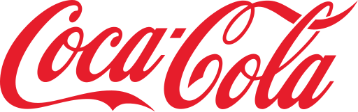

  

# 🥤 Coca-Cola Sales & Profit Analysis – 🐍 Python + 📊 Power BI

This project presents an end-to-end analysis of Coca-Cola’s beverage sales and operating profit across various U.S. retailers, states, and time periods using 🐍 **Python** for exploratory data analysis (EDA) and 📊 **Power BI** for interactive visualization. The goal is to extract actionable business insights by combining the analytical power of Python with the storytelling capabilities of Power BI.

---

## 📌 Overview

The dataset contains real-world performance metrics across:

- 🛒 U.S. **Retailers** (e.g., Walmart, CVS)  
- 🗺️ **States** and **Geographic Regions**  
- 🧃 **Beverage Brands** (e.g., Coca-Cola, Diet Coke, Dasani, Sprite, Fanta, Powerade)  
- 💰 **Operating Profit** and **Units Sold**  
- 📅 **Monthly and Seasonal Trends**

> **Note:** In this project, **"Coca-Cola"** refers specifically to the **classic cola beverage (Coca-Cola Classic)** and is treated as a distinct brand from others like Diet Coke or Sprite, though they are all owned by The Coca-Cola Company.

---

## 🥤 About Coca-Cola

[Coca-Cola](w) is the flagship carbonated soft drink produced by The Coca-Cola Company, founded in 1886 and headquartered in Atlanta, Georgia. It remains one of the world’s most iconic beverage brands and holds a strong position in the U.S. market. Alongside products like Sprite, Fanta, and Dasani, Coca-Cola continues to drive massive sales volume—making it a relevant subject for performance and trend analysis.

---

## 🎯 Project Objective

The goal is to extract actionable business insights by combining the analytical power of Python with the storytelling capabilities of Power BI.

---

## 💡 Personal Motivation

This dataset was particularly meaningful because my mum runs a wholesale business that distributes Coca-Cola products. Working with this data allowed me to connect technical analysis with real-world experience while sharpening my skills in Python and data visualization.

---

## ❓ Business Questions Explored

1. What are the top 3 beverage brands by total units sold?
2. Which U.S. regions generate the highest operating profit?
3. Which 5 cities contribute most to sales and profit?
4. How do sales and profits trend throughout the year?
5. How does each brand perform based on operating margin?

---

## 🔍 Key Insights

- **Coca-Cola Classic** was the top-selling beverage brand by total units.
- The **Southern U.S.** region recorded the highest operating profit.
- Cities such as **Atlanta**, **Houston**, and **Los Angeles** led in both total sales and profit.
- Sales and profits spiked during the **summer months (May–July)** and **December**, aligning with holiday and warm-weather consumption trends.
- **Powerade** had a high **operating margin** despite lower total sales.
- **Diet Coke** lagged behind Coca-Cola and Sprite in both sales volume and profit contribution.

---

## 🗃️ Dataset Summary

- **Source:** Provided for a data analytics project  
- **Geographic Focus:** United States  
- **Key Fields:**  
  - `Total Sales`  
  - `Operating Profit`  
  - `Beverage Brand`  
  - `Retailer Name`  
  - `State`, `Region`, `City`  
  - `Month`, `Season`  
  - `Delivery Method`

---

## 🛠 Tools & Libraries Used

- **Python**  
- [`Pandas`](w) – Data manipulation  
- [`NumPy`](w) – Numerical operations  
- [`Matplotlib`](w) & [`Seaborn`](w) – Data visualization  
- **Jupyter Notebook** – Notebook environment for analysis and storytelling

## 📊 Power BI Dashboard

To complement the Python-based EDA, I created an interactive **Power BI dashboard** to visualize Coca-Cola’s sales and profit performance more dynamically.

This dashboard serves as the **visual storytelling layer**, highlighting trends, comparisons, and performance metrics across brands, retailers, time periods, and regions.

### 🔍 Dashboard Insights:
- **Walmart** generated over **$4.4M** more in sales than other retailers.
- **December** recorded the **highest sales volume**, exceeding **$984K**.
- The **West Coast** led in operating profit, generating **$2.37M**.
- **Coca-Cola (Coke)** stood out with **$4.0M** in sales, showing strong consumer loyalty.
